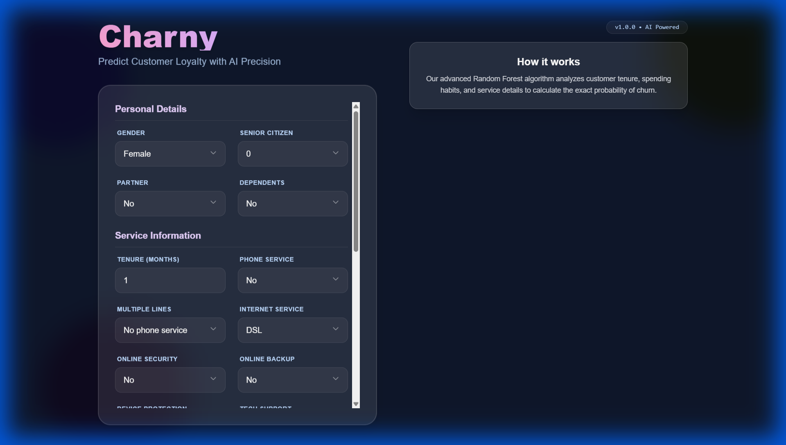

# Charny - Customer Churn Prediction



Charny is a modern, full-stack web application designed to predict customer churn rates using a Machine Learning model. It provides a sleek, user-friendly interface for inputting customer data and receiving real-time churn probability predictions.

## Features

*   **Real-time Prediction**: Get instant churn probability based on customer data.
*   **Comprehensive Input Form**: detailed form covering personal details, service information, and billing preferences.
*   **Interactive UI**: Built with React and Tailwind CSS for a responsive and modern experience.
*   **ML-Powered Backend**: Utilizes a Scikit-learn pipeline served via Flask for accurate predictions.

## Tech Stack

*   **Frontend**: React, Vite, Tailwind CSS
*   **Backend**: Flask, Python
*   **Machine Learning**: Scikit-learn, Pandas, NumPy, Joblib

## Prerequisites

Ensure you have the following installed:

*   [Node.js](https://nodejs.org/) (v14 or higher)
*   [Python](https://www.python.org/) (v3.8 or higher)

## Installation

### 1. Clone the Repository
```bash
git clone <repository-url>
cd charny
```

### 2. Backend Setup
Navigate to the server directory and install Python dependencies:
```bash
cd server
pip install -r requirements.txt
```

### 3. Frontend Setup
Navigate to the client directory and install Node.js dependencies:
```bash
cd client
npm install
```

## Usage

You can start the application using the provided batch script or by running the backend and frontend manually.

### Option 1: Using the Start Script (Windows)
Double-click `start_app.bat` in the root directory, or run it from the command line:
```cmd
start_app.bat
```

### Option 2: Manual Start

**Start the Backend:**
```bash
cd server
python app.py
```
The backend will run on `http://127.0.0.1:5000`.

**Start the Frontend:**
```bash
cd client
npm run dev
```
The frontend will run on `http://localhost:5173`.

## API Reference

### Predict Churn

*   **URL**: `/predict`
*   **Method**: `POST`
*   **Content-Type**: `application/json`
*   **Request Body**:
    ```json
    {
      "gender": "Female",
      "SeniorCitizen": 0,
      "Partner": "Yes",
      "Dependents": "No",
      "tenure": 12,
      "PhoneService": "No",
      "MultipleLines": "No phone service",
      "InternetService": "DSL",
      "OnlineSecurity": "No",
      "OnlineBackup": "Yes",
      "DeviceProtection": "No",
      "TechSupport": "No",
      "StreamingTV": "No",
      "StreamingMovies": "No",
      "Contract": "Month-to-month",
      "PaperlessBilling": "Yes",
      "PaymentMethod": "Electronic check",
      "MonthlyCharges": 29.85,
      "TotalCharges": 29.85
    }
    ```
*   **Success Response**:
    *   **Code**: 200 OK
    *   **Content**:
        ```json
        {
          "churn_prediction": 0,
          "churn_probability": 0.45
        }
        ```

## Project Structure

*   `client/`: React frontend application.
*   `server/`: Flask backend and ML model files (`model.pkl`, `scaler.pkl`).
*   `assets/`: Project assets (screenshots, etc.).
*   `start_app.bat`: Script to start both backend and frontend.
